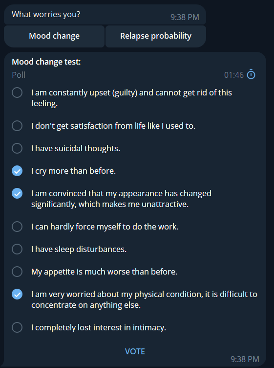
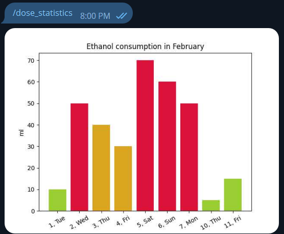
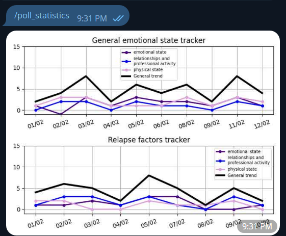
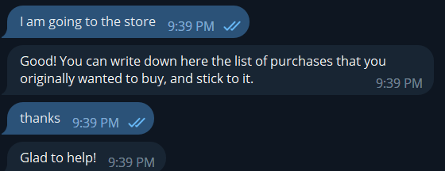
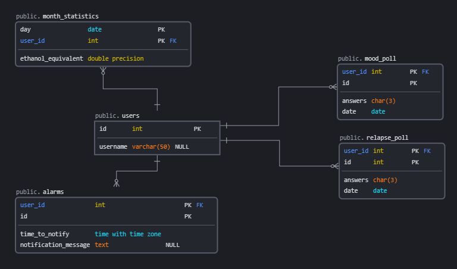

## Iriska

Iriska is a personal assistant Telegram bot designed for people in remission from any type of medical addiction, with a focus on Borderline Personality Disorder (BPD). Iriska aims to provide a wide range of functionality to support users in their recovery journey.

The bot's features include:

1. Customized speech/text alarms to help users stay on track with their recovery goals.
2. Tests to monitor symptoms of depression and relapse probability.
3. Detailed statistics on relapse probability and mood changes to help users understand their progress.
4. A 24/7 option for small talk and kind words to provide emotional support.
5. Access to general medical information about the type of addiction to help users stay informed.
6. A shop assistant and relapse helper to provide practical support.
7. A monthly alcohol drinking tracker to monitor drinking habits.

Iriska is a powerful tool that can help users in their recovery journey, providing support, information, and accountability. With its wide range of features, Iriska is a comprehensive solution for anyone looking to improve their chances of success in overcoming addiction.

